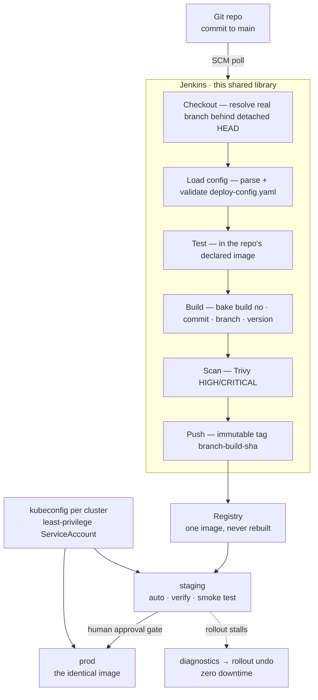

<div align="center">


# CI/CD Pipeline — Shared Library

### One Jenkins pipeline, written once in Groovy. Any repository. Any Kubernetes cluster. Onboarding a service is **two files and no pipeline code**.

[](LICENSE)
[](#tech-stack)
[](#testing)
[](#the-contract)
[](#security)
[](#failure-handling)

[](#tech-stack)
[](#tech-stack)
[](#tech-stack)
[](https://github.com/ayushgupta07xx/cicd-pipeline-platform)
[](#security)
[](https://github.com/ayushgupta07xx/cicd-pipeline-platform)
[](https://github.com/ayushgupta07xx/cicd-pipeline-platform)
[](#tech-stack)

<br/>

[](https://youtu.be/8HLydMg_BCg)

📘 **[Documentation](https://ayushgupta07xx.github.io/cicd-pipeline-sample-app/)** · 🐍 **[Sample App](https://github.com/ayushgupta07xx/cicd-pipeline-sample-app)** · 🟩 **[Orders API](https://github.com/ayushgupta07xx/cicd-pipeline-orders-api)** · 🏗 **[Platform](https://github.com/ayushgupta07xx/cicd-pipeline-platform)**

</div>

---

Pipeline logic copied into ten repositories is ten places to fix a bug, and they drift the day after you write them. The usual answer — a Jenkinsfile per project — satisfies "build on commit" and fails the requirement that actually matters: **be adaptable to different Git repositories and different Kubernetes clusters.**

This library is the other answer. Every stage — test, build, scan, push, promote, verify, roll back — lives here, once. An application repository contributes a **three-line Jenkinsfile** and a declarative **`deploy-config.yaml`** describing what it is and where it goes. Adding a third cluster is a block of YAML. Onboarding a service is two files. Neither touches pipeline code.

That claim is tested rather than asserted: two deliberately dissimilar services — **Python/Flask** and **Node/Express** — run this library unmodified. Onboarding the second one **found a real defect in the library**, which is documented below alongside the fix.

## The contract

Everything a repository writes:

**`Jenkinsfile`**
```groovy
@Library('finacplus-cicd@main') _

deliveryPipeline()
```

**`deploy-config.yaml`** (excerpt)
```yaml
test:
  image: "python:3.12-slim"        # the library assumes no language runtime
  setup: "pip install -q -r requirements.txt pytest"
  commands: ["python -m pytest -q"]

environments:
  - name: staging
    cluster: kind-staging
    credentialId: kubeconfig-staging
    branches: ["main"]             # [] = build + test only, never deploy
    autoDeploy: true
    smokeTest: { path: /health, expectStatus: 200 }

  - name: prod
    cluster: kind-prod
    credentialId: kubeconfig-prod
    autoDeploy: false
    approval: { required: true, timeoutMinutes: 15 }
```

Full onboarding guide: **[docs/onboarding.md](https://github.com/ayushgupta07xx/cicd-pipeline-platform/blob/main/docs/onboarding.md)**

## How it works



| Stage | Behaviour | On failure |
|---|---|---|
| **Checkout** | Resolves commit SHA and the real branch behind Jenkins' detached-HEAD checkout | Abort |
| **Load config** | Parses and validates `deploy-config.yaml`; resolves which environments this branch may reach | Abort with a precise schema error |
| **Test** | Runs the repository's commands in the repository's declared image | Abort — before any image exists |
| **Build image** | Bakes build number, commit, branch, version into the artifact | Abort |
| **Scan image** | Trivy at the configured severity | Unstable, or fail if `failOnFindings` |
| **Push image** | Publishes the immutable tag; skipped when the branch targets no environment | Abort |
| **Deploy** | Per environment, in declared order: optional approval → apply → await rollout → smoke test | Diagnostics printed, automatic rollback |

## Failure handling

A green rollout only means containers started. **Ready is not the same as working** — so the pipeline blocks on `kubectl rollout status`, then proves the service answers through its Service DNS name before declaring success.

When it doesn't:

```
Rollout FAILED (exit 1) — collecting diagnostics
--- pods ---
sample-app-67b654cf7f-985nn   0/1   Running   2m20s     ← new build, never Ready
--- recent events ---
Warning  Unhealthy  Readiness probe failed: HTTP probe failed with statuscode: 503
--- logs (most recent pod) ---
Rolling back sample-app in staging to previous revision
Rollback complete — previous version restored
```

And because the manifests set `maxUnavailable: 0`, a new pod must pass readiness before an old one retires — **a broken build physically cannot displace a working one**:

```
sample-app-67b654cf7f-985nn   0/1   Running   50s   ← new build, never Ready
sample-app-78499767c7-tpvhm   1/1   Running   12m   ← still serving
sample-app-78499767c7-v7r6q   1/1   Running   12m   ← still serving
```

Detected, diagnosed, reverted — about two minutes, unattended, and production is never reached because the pipeline aborts before the gate.

## Security

Jenkins authenticates to each cluster as a **namespaced ServiceAccount** bound to a `Role` — never a `ClusterRole`. Read from the live API server, not from YAML:

```
$ kubectl auth can-i --list -n demo --as=system:serviceaccount:demo:jenkins-deployer
deployments.apps    [get list watch create update patch]
replicasets.apps    [get list watch]
services            [get list create update patch]
pods, pods/log      [get list watch]
events              [get list]
pods/portforward    [create]
```

| Capability | | Rationale |
|---|---|---|
| `patch deployments` | ✅ | Required to deploy |
| `watch deployments` | ✅ | `rollout status` opens a watch stream |
| `create pods/portforward` | ✅ | Narrowest grant that permits smoke verification |
| `create pods` | ❌ | Would let CI schedule arbitrary workloads |
| `delete deployments` | ❌ | Deploying never requires deleting |
| `get secrets` | ❌ | No reason to read them |
| anything in `kube-system` | ❌ | The namespaced Role is a hard boundary |

Secrets never enter Groovy — the kubeconfig is dereferenced by the **shell** as `$KUBECONFIG_FILE`, because Groovy string interpolation of a credential is an exfiltration path Jenkins explicitly warns about. Full detail: **[docs/security.md](https://github.com/ayushgupta07xx/cicd-pipeline-platform/blob/main/docs/security.md)**

## Layout

```
vars/deliveryPipeline.groovy          pipeline entrypoint + stage orchestration
src/io/finacplus/cicd/
  DeployConfig.groovy                 parse + fail-fast validation of deploy-config.yaml
  Deployer.groovy                     render → apply → verify → diagnose → roll back
test/
  DeployConfigTest.groovy             12 unit tests, no Jenkins required
  run-tests.sh                        runs them in a pinned container
```

`src/` holds **plain Groovy classes**, not pipeline script. They receive the `CpsScript` object by constructor so they can invoke steps — but the logic itself is ordinary, testable Groovy. That separation is what "flexibility and extensibility" means in practice rather than in a bullet point.

## Testing

```bash
./test/run-tests.sh          # 12 tests · no Jenkins · pinned container
```

`DeployConfig` takes the script object by constructor, so a stub is enough to test parsing, validation, branch filtering, tag generation and security defaults in isolation. Two tests are **regressions for defects this project actually hit**:

| Test | Guards against |
|---|---|
| `test.image required when test.commands present` | The library once hardcoded a Python image, silently running `npm test` inside `python:3.12-slim` |
| `imageRef sanitises branch names into valid docker tags` | A branch named `feature/x` yields an invalid Docker tag and fails at push |

Beyond that, the library is verified end to end by two dissimilar real services. A change that only works for Python is caught immediately.

## Implementation notes

Three constraints of the Jenkins **CPS runtime** shaped this code — each discovered by a failure, not anticipated:

**`return` inside `withCredentials`/`withEnv` closures does not return from the enclosing method.** It returns from the closure. A method that appears to return `false` on failure can silently return something else — a failed deploy reported as success. Results are captured in a variable declared outside the closure.

**Closure-taking steps are unreliable when called from a `src/` class.** The closure can arrive `null`, producing `NullPointerException: Cannot invoke "groovy.lang.Closure.clone()"`. `Deployer` calls no closure-taking steps; environment is exported inside the shell script instead.

**Jenkins checks out a detached HEAD**, so `git rev-parse --abbrev-ref HEAD` returns the literal string `HEAD`. The first green build of this pipeline **deployed nothing** — every stage green, `Push` and `Deploy` `NOT_EXECUTED`, because the branch matched zero environments. The branch is now resolved from the remote ref that points at the commit, with fallbacks.

## Tech stack

| Layer | Tools |
|---|---|
| Pipeline | Jenkins (LTS, JDK17) · Groovy shared library · declarative + scripted stages |
| Config | YAML contract per repo · `pipeline-utility-steps` (`readYaml`) · fail-fast validation |
| Build | Docker (socket-mounted, DooD) · immutable tags `branch-build-sha` |
| Security | Trivy image scanning · Jenkins file credentials · namespaced RBAC |
| Deploy | `kubectl` · `envsubst`-templated manifests · `rollout status` / `rollout undo` |
| Verification | In-cluster smoke test through the Service, via `pods/portforward` |
| Controller | Configuration-as-Code (JCasC) — no setup wizard, no click-ops |
| Testing | Plain Groovy assertions in a pinned `groovy:4.0-jdk17` container |

## Honest limitations

- **Branch matching is exact.** `branches: ["release/*"]` does not glob today — it matches literally. One-line fix, and stated here rather than discovered by you.
- **`Deployer` has no unit tests.** It is mostly shell orchestration; testing it in isolation would assert on generated command strings rather than behaviour. It is covered end to end instead.
- **Push-based deployment has a window.** If Jenkins dies between `kubectl apply` and `rollout status`, the rollout continues without verification or auto-rollback. The strongest argument for GitOps, and named as such.
- **Everything tracks `main`.** Fine for two repositories, reckless for fifty — a real deployment tags library releases and lets repos pin.

More, including what production would do instead: **[docs/security.md](https://github.com/ayushgupta07xx/cicd-pipeline-platform/blob/main/docs/security.md)** and the Constraints section of the **[case study](https://ayushgupta07xx.github.io/cicd-pipeline-sample-app/#constraints)**.

## Documentation

| Document | Covers |
|---|---|
| [setup.md](https://github.com/ayushgupta07xx/cicd-pipeline-platform/blob/main/docs/setup.md) | Reproducing the whole platform from scratch |
| [onboarding.md](https://github.com/ayushgupta07xx/cicd-pipeline-platform/blob/main/docs/onboarding.md) | Adding a new repository or a new cluster |
| [validation.md](https://github.com/ayushgupta07xx/cicd-pipeline-platform/blob/main/docs/validation.md) | Test cases and 10 validation procedures |
| [monitoring.md](https://github.com/ayushgupta07xx/cicd-pipeline-platform/blob/main/docs/monitoring.md) | Metrics, alerts, dashboards, logging strategy |
| [security.md](https://github.com/ayushgupta07xx/cicd-pipeline-platform/blob/main/docs/security.md) | RBAC, secrets, container hardening, supply chain |

## License

Code under **Apache 2.0** — see [`LICENSE`](LICENSE).

---

<div align="center">

Built by **Ayush Gupta** · [GitHub](https://github.com/ayushgupta07xx) · [LinkedIn](https://www.linkedin.com/in/ayush-gupta-544a803a2)

</div>
